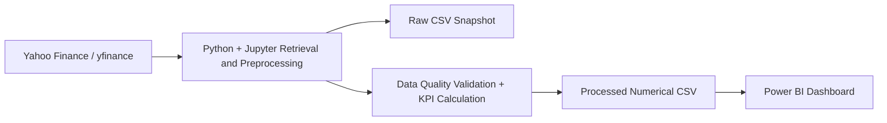

# Week 6 Analytical Methodology Architecture

## Architecture diagram

**Figure 1. CIS480 analytical methodology architecture.**

**Text equivalent / alt description:** Public historical market data are retrieved from Yahoo Finance through yfinance within the Python/Jupyter workflow. That workflow preserves the retrieved source data as a raw CSV snapshot and performs preprocessing. The Python/Jupyter workflow also feeds data-quality validation and historical KPI calculations. The resulting numerical processed CSV is then consumed by Power BI for the interactive historical comparison dashboard.

## Week 6 team review revision

Rey Guirette reviewed the methodology architecture against the data retrieval and preparation work he completed. His review confirmed the data source, 2021–2025 coverage period, selected securities, and Python/Jupyter ETL workflow. He identified a minor diagram clarification: the raw CSV snapshot and the validation/KPI path are outputs of the Python/Jupyter workflow rather than a strictly linear Raw CSV → Python-only depiction. The diagram and text equivalent above were revised to reflect that review. See GitHub Issue #1 for the review evidence.
